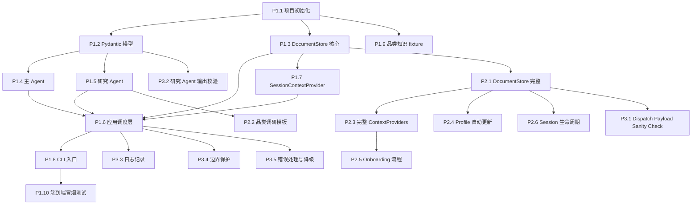

# TASKS.md — 实现任务拆解与排期

> 本文档定义购物推荐 Agent 的实现任务列表，按依赖关系和开发阶段组织。每个任务包含前置依赖、涉及的源文档章节、输出物和验收条件。
>
> **阅读前提**：SPEC.md（产品规格）、ARCHITECTURE.md（系统架构）、INTERFACES.md（接口契约）、PROMPTS.md（Prompt 模板）。

---

## 一、整体分期策略

### 1.1 四阶段概述

| 阶段 | 目标 | 核心交付物 |
|------|------|-----------|
| **Phase 1** | 最小可运行 Agent 闭环 | 跑通一次完整的需求挖掘 → 搜索 → 推荐主路径，并支持任务形态识别、轻量搭配/补齐任务和必要时的多次产品搜索 |
| **Phase 2** | 文档体系 + Profile | 完整的四层记忆系统、品类调研自动化、画像草稿与恢复检查 |
| **Phase 3** | 质量保障 | payload 校验、输出校验、边界保护、错误处理、日志 |
| **Phase 4** | 扩展 | Web UI、画像迁移、性能优化 |

### 1.2 依赖关系图



---

## 二、Phase 1：最小可运行闭环

> **Phase 目标**：先跑通最小可运行的 Agent 主路径：需求挖掘 → 产品搜索 → 推荐。该阶段不仅要覆盖典型单品选购，也要支持任务形态识别，以及轻量的搭配/补齐/升级任务处理能力，例如围绕同一购物目标按需记录 `goal_summary` / `existing_items` / `missing_items`，并在必要时多次触发 `dispatch_product_search`。品类调研和 onboarding 在后续阶段接入，但不再作为“冻结不支持”的旧口径保留。

---

### P1.1 项目初始化

| 项目 | 说明 |
|------|------|
| **依赖** | 无 |
| **源文档** | ARCHITECTURE.md §一（技术栈）、§6.1（数据目录结构） |
| **输出物** | 项目目录结构、`pyproject.toml` / `requirements.txt`、空模块文件 |

**内容**：

1. 创建项目目录结构：

```
shopping/
├── src/
│   ├── __init__.py
│   ├── models/              # Pydantic 模型
│   │   └── __init__.py
│   ├── agents/              # Agent 定义
│   │   └── __init__.py
│   ├── store/               # DocumentStore
│   │   └── __init__.py
│   ├── context/             # ContextProviders
│   │   └── __init__.py
│   ├── router/              # Action Router
│   │   └── __init__.py
│   ├── utils/               # 工具模块（日志等）
│   │   └── __init__.py
│   ├── app.py               # 应用调度层（外部循环）
│   └── cli.py               # CLI 入口
├── data/                    # 运行时数据（git 忽略）
│   ├── sessions/
│   ├── knowledge/
│   └── user_profile/
│       └── category_preferences/
├── tests/
│   └── __init__.py
├── docs/                    # 开发文档
├── pyproject.toml
├── requirements.txt
└── .gitignore
```

2. 安装依赖：`microsoft-agent-framework`（MAF）、`pydantic`、搜索工具依赖（`tavily-python` 或等效）
3. 配置 `.gitignore`（忽略 `data/`、`.env`、`__pycache__/` 等）
4. 配置环境变量加载（`.env` 文件管理 API keys）

**验收条件**：
- [ ] `import src` 不报错
- [ ] `data/` 目录结构存在
- [ ] 依赖安装成功

---

### P1.2 Pydantic 模型定义

| 项目 | 说明 |
|------|------|
| **依赖** | P1.1 |
| **源文档** | INTERFACES.md §一（全部 Pydantic 模型） |
| **输出物** | `src/models/decision.py`、`src/models/research.py` |

**内容**：

1. 实现 `decision.py`：
   - `DimensionUpdate`
   - `InternalReasoning`
   - `DecisionOutput`

2. 实现 `research.py`：
   - `ProductInfo`
   - `ProductSearchOutput`
   - 品类调研相关模型（`CategoryKnowledge`、`ProductTypeKnowledge`、`CategoryResearchOutput` 等）——Phase 2 才会用到，但建议在此统一定义

**验收条件**：
- [ ] 所有模型可以成功实例化并序列化为 JSON
- [ ] `DecisionOutput` 的字段约束生效（如 priority 范围 1-4）
- [ ] `next_action` 仅允许 5 个合法值，非法值会触发 ValidationError

---

### P1.3 DocumentStore 核心

| 项目 | 说明 |
|------|------|
| **依赖** | P1.1 |
| **源文档** | INTERFACES.md §四（DocumentStore 接口）、ARCHITECTURE.md §6.2-6.4（文件操作模型） |
| **输出物** | `src/store/document_store.py` |

**内容**：

Phase 1 只实现 session 相关接口：

```python
class DocumentStore:
    def load_session() -> Optional[dict]
    def save_session(state: dict) -> None
    def list_historical_sessions() -> list[dict]
    def apply_pending_profile_updates(session: dict) -> bool
```

关键实现要点：
- 所有路径基于 `data/` 目录
- `save_session` 每次写入时自动更新 `last_updated` 字段
- `session_updates` 的白名单 key 验证由应用层在合并前执行：`intent`、`product_type`、`category`、`decision_progress`、`requirement_profile`、`jtbd_signals`、`error_state`、`goal_summary`、`existing_items`、`missing_items`
- `save_session()` 负责保存完整 session state；`pending_research_result` / `pending_profile_updates` / `candidate_products` 为系统管理字段，不在 `save_session()` 内做隐式清理或推断
- `current_session.json` 默认长期保留；恢复检查在下次启动时执行，而不是在保存时隐式触发
- JSON 文件读写使用 `json.load()` / `json.dump()`，`ensure_ascii=False`

**验收条件**：
- [ ] session 的创建、读取、更新、保留流程正确
- [ ] 白名单外的 `session_updates` key 在应用层合并前被拒绝
- [ ] `last_updated` 自动更新

---

### P1.4 主 Agent 定义

| 项目 | 说明 |
|------|------|
| **依赖** | P1.2 |
| **源文档** | PROMPTS.md §一（完整 System Prompt）、ARCHITECTURE.md §5.1（主 Agent 无 FunctionTool） |
| **输出物** | `src/agents/main_agent.py` |

**内容**：

1. 定义主 Agent 的创建函数/类：
   - `instructions` = PROMPTS.md §1.2 的完整 System Prompt
   - `output_type` = `DecisionOutput`
   - `model` = 强推理模型（GPT-4o / Claude Opus，从配置读取）
   - **无 tools**（纯推理器）

2. Agent 每次被外部循环调用时：
   - 接收 context（由 ContextProviders 组装）+ 用户消息
   - 输出 `DecisionOutput`

**验收条件**：
- [ ] Agent 实例创建成功
- [ ] 输出格式为 `DecisionOutput`
- [ ] Agent 没有注册任何 FunctionTool

---

### P1.5 研究 Agent — 产品搜索

| 项目 | 说明 |
|------|------|
| **依赖** | P1.2 |
| **源文档** | PROMPTS.md §2.2（产品搜索模板）、ARCHITECTURE.md §5.2（搜索工具）、§八（独立 context 实现） |
| **输出物** | `src/agents/research_agent.py`、`src/agents/tools.py` |

**内容**：

1. 实现搜索工具（`tools.py`）：
   - 方式一（推荐）：配置模型内置 web search
   - 方式二：包装 Tavily API 的 `search_web` 函数

2. 实现 `execute_research()` 函数：
   - 接收 `task_type` 和 `action_payload`
   - Phase 1 仅支持 `dispatch_product_search`
   - 从 PROMPTS.md §2.2 的模板填充 instructions
   - 从 `action_payload.research_brief` 获取搜索策略提示（可选），若未提供则使用默认提示
   - 如仅做本地 fixture / 手工验证，可临时硬编码为中文，但这属于测试限定，不属于正式实现口径
   - `dispatch_product_search` 的 payload 校验接受 `constraints.budget = null / "unspecified"` 的合法情况
   - 创建研究 Agent 实例 → 运行 → 返回 `ProductSearchOutput`
   - 每次创建新实例（独立 context）

**验收条件**：
- [ ] 研究 Agent 可独立运行搜索任务
- [ ] 输出为 `ProductSearchOutput` 结构
- [ ] 每次调用创建新实例（验证 context 隔离）

---

### P1.6 应用调度层（外部循环 + Action Router）

| 项目 | 说明 |
|------|------|
| **依赖** | P1.3、P1.4、P1.5、P1.7 |
| **源文档** | ARCHITECTURE.md §三（两层循环运行模型）、§十（Action Router 契约） |
| **输出物** | `src/app.py`、`src/router/action_router.py` |

**内容**：

1. 实现外部循环主函数（`app.py`）：
   - 按 ARCHITECTURE.md §3.1 的伪代码实现
   - Phase 1 主路径先跑通 `ask_user`、`recommend`、`dispatch_product_search`
   - 不把 Phase 1 限定为“一次搜索后固定两轮推荐结束”；要允许主 Agent 围绕同一购物目标多次进入 `dispatch_product_search`
   - 文档与代码结构从一开始就保留 `dispatch_category_research` 和 `onboard_user` 的接入位，不再保留“长期不支持”的旧口径

2. 实现 Action Router（`action_router.py`）：
   - `ask_user` / `recommend`：发送 `user_message` 给用户，等待输入
   - `dispatch_product_search`：发送过渡消息 → 调用 `execute_research()` → 后处理
   - 每轮通用后置动作：
     - 写入 `session_updates`
     - 如本轮消费了 `pending_research_result` → 清除它
     - 检查 `decision_progress.recommendation_round` 是否变为 `"完成"` → 将 `profile_updates` 写入 `pending_profile_updates` 草稿区
   - 恢复检查属于启动逻辑，不放到每轮 ContextProvider 路径里

3. dispatch 后处理（产品搜索）：
   - Pydantic 结构校验
   - 包装为 `pending_research_result: { "type": "product_search", "result": {...} }`
   - 同步刷新 `candidate_products`（保存当前研究焦点下的 research agent 初筛候选池）
   - 写入 session
   - 重置 `recommendation_round` 为 `"未开始"`
   - 回到循环顶部（不等用户输入）

**验收条件**：
- [ ] 外部循环可以正确执行多轮对话
- [ ] `ask_user` / `recommend` 正确返回消息并等待输入
- [ ] `dispatch_*` 执行前，用户先收到 `user_message` 过渡消息
- [ ] `dispatch_product_search` 正确触发研究 Agent 并处理结果
- [ ] 主 Agent 可以识别单品选购 vs 搭配/补齐/升级等任务形态，并写入与当前购物目标相关的 session 信息
- [ ] `session_updates` 每轮正确写入
- [ ] `pending_research_result` 在下一轮消费后被清除（不依赖 `session_updates`）
- [ ] `candidate_products` 在产品搜索后被正确刷新，并可在同一购物目标下被多次刷新后继续复用
- [ ] `recommendation_round` 在产品搜索后被重置
- [ ] `recommendation_round = "完成"` 时只生成 `pending_profile_updates` 草稿，不立即写长期画像

---

### P1.7 SessionContextProvider

| 项目 | 说明 |
|------|------|
| **依赖** | P1.3 |
| **源文档** | ARCHITECTURE.md §7.1（SessionContextProvider）、PROMPTS.md §3.1（注入格式） |
| **输出物** | `src/context/session_provider.py` |

**内容**：

Phase 1 的最小版 SessionContextProvider：
- 从 `sessions/current_session.json` 加载 session state
- 格式化为 PROMPTS.md §3.1 定义的注入格式
- 如有 `goal_summary` / `existing_items` / `missing_items` → 一并注入当前任务上下文
- 如有 `pending_research_result` → 注入研究结果
- 不在常规每轮路径中执行恢复检查；恢复检查属于启动逻辑
- 如 session 不存在 → 创建新 session（生成 `session_id`，格式 `{date}-{HHMMSS}`）

**验收条件**：
- [ ] session state 正确加载并格式化为 context 文本
- [ ] `pending_research_result` 正确注入
- [ ] 新 session 的 `session_id` 格式正确

---

### P1.8 CLI 入口

| 项目 | 说明 |
|------|------|
| **依赖** | P1.6 |
| **源文档** | SPEC.md §1.3（CLI 交互界面） |
| **输出物** | `src/cli.py` |

**内容**：

1. 简单的 CLI 交互：
   - 启动时打印欢迎信息
   - 循环读取用户输入 → 传入应用调度层 → 打印 Agent 回复
   - 启动时先执行恢复检查：若存在未应用的 `pending_profile_updates`，先决定是否应用到长期画像
   - 支持退出指令（`/quit`、`/end`）→ 正常结束当前进程，不要求默认归档 current session
   - `Ctrl+C` 优雅退出

2. 使用 `asyncio.run()` 启动异步主循环

**验收条件**：
- [ ] CLI 可以正常启动并接受用户输入
- [ ] Agent 回复正确打印
- [ ] 启动时恢复检查可正常运行
- [ ] `/quit` 退出不会破坏当前 session
- [ ] `Ctrl+C` 不会导致数据丢失

---

### P1.9 测试 Fixture：品类知识文档

| 项目 | 说明 |
|------|------|
| **依赖** | P1.1 |
| **源文档** | INTERFACES.md §3.1（品类知识文档 Schema） |
| **输出物** | `tests/fixtures/户外装备.json` |

**内容**：

手工编写一份冲锋衣的品类知识文档 fixture，包含：
- `category_knowledge`：产品类型概览、通用概念（GORE-TEX 等）、品牌全景
- `product_types.冲锋衣`：决策维度、tradeoffs、价位段、场景映射、常见误区

该 fixture 用于 Phase 1 测试时跳过品类调研流程，直接从需求挖掘开始。

Phase 1 中 KnowledgeContextProvider 的最小实现：在运行前由初始化脚本、测试 setup 或手动准备步骤将该 fixture 复制到 `data/knowledge/户外装备.json`，再直接加载运行时文件注入 context（不做选择性加载）。

**验收条件**：
- [ ] JSON 结构符合 INTERFACES.md §3.1 的 Schema
- [ ] 内容覆盖冲锋衣品类的核心维度和 tradeoffs
- [ ] fixture 可以被复制到 `data/knowledge/` 并被 ContextProvider 正确加载

> [!NOTE]
> 该手工文档是 Phase 1 测试用的 fixture，应保留在 `tests/fixtures/` 中。P2.2 品类调研完成后，运行时的 `data/knowledge/户外装备.json` 应由真实调研结果替代，但测试 fixture 继续保留用于单元测试和集成测试。

---

### P1.10 端到端冒烟测试

| 项目 | 说明 |
|------|------|
| **依赖** | P1.8（所有 Phase 1 任务） |
| **源文档** | SPEC.md §14.2 场景 A（Happy Path） |
| **输出物** | 测试脚本 + 测试记录 |

**内容**：

手动执行一次最小可运行流程（基于冲锋衣场景），验证系统可运行性：

1. CLI 启动后，输入“想买一件冲锋衣”，Agent 可以正常回复
2. 对话可以持续至少 3 轮，session 文件持续更新
3. `dispatch_product_search` 可以成功触发，研究 Agent 返回结构化结果
4. 整个流程中无未处理异常

**验收条件**：
- [ ] CLI 可以启动并完成最小对话闭环
- [ ] `data/sessions/current_session.json` 在多轮对话中持续更新
- [ ] `dispatch_product_search` 触发后能返回可消费的研究结果
- [ ] 整个流程无未处理异常

---

## 三、Phase 2：文档体系 + Profile

> **Phase 目标**：实现完整的四层文档化记忆体系——品类调研自动化、用户画像持久化、onboarding、session 生命周期管理。

---

### P2.1 DocumentStore 完整实现

| 项目 | 说明 |
|------|------|
| **依赖** | P1.3 |
| **源文档** | INTERFACES.md §四（完整 DocumentStore 接口） |
| **输出物** | `src/store/document_store.py`（扩展） |

**内容**：

在 Phase 1 的 session CRUD 基础上，增加：

```python
# Knowledge
def load_knowledge(category: str, product_type: str = None) -> Optional[dict]
def save_knowledge(category: str, data: dict) -> None
def merge_product_type(category: str, product_type: str, data: dict) -> None

# Profile
def load_global_profile() -> Optional[dict]
def save_global_profile(updates: dict) -> None
def load_category_preferences(category: str) -> Optional[dict]
def save_category_preferences(category: str, updates: dict) -> None
```

关键实现要点：
- `load_knowledge` 实现选择性加载：返回 `category_knowledge` + 指定 `product_type` section
- `merge_product_type` 实现增量合并：向已有品类文档添加新的 `product_types.*` section
- `save_global_profile` / `save_category_preferences` 支持 section 级替换
- 所有方法的 create-if-not-exist 行为

**验收条件**：
- [ ] Knowledge 文件的选择性加载正确（只返回请求的 product_type）
- [ ] 增量合并不覆盖已有 product_type sections
- [ ] Profile 文件的创建和更新正确
- [ ] 文件不存在时返回 `None`（不报错）

---

### P2.2 品类调研模板 + 知识文档自动创建

| 项目 | 说明 |
|------|------|
| **依赖** | P1.5、P2.1 |
| **源文档** | PROMPTS.md §2.1（品类调研模板）、ARCHITECTURE.md §九（Dispatch 后处理） |
| **输出物** | `src/agents/research_agent.py`（扩展） |

**内容**：

1. 扩展 `execute_research()` 支持 `dispatch_category_research`：
   - 从 PROMPTS.md §2.1 的模板填充 instructions
   - 输出类型为 `CategoryResearchOutput`
   - 后处理：
     - 品类文档不存在 → `DocumentStore.save_knowledge()` 新建
     - 品类文档存在但缺 product_type → `DocumentStore.merge_product_type()` 增量合并
   - 将结果包装为 `pending_research_result: { "type": "category_research", "result": {...} }`

2. 扩展 Action Router 支持 `dispatch_category_research`

**验收条件**：
- [ ] 品类调研任务可以成功执行
- [ ] 新品类文档正确创建（含 `category_knowledge` + `product_types.*`）
- [ ] 已有品类文档正确增量合并新 product_type
- [ ] `pending_research_result` 正确设置

---

### P2.3 完整 ContextProviders

| 项目 | 说明 |
|------|------|
| **依赖** | P2.1 |
| **源文档** | ARCHITECTURE.md §七（ContextProvider 设计）、PROMPTS.md §三（Context 注入格式） |
| **输出物** | `src/context/knowledge_provider.py`、`src/context/profile_provider.py`（新增），`src/context/session_provider.py`（扩展） |

**内容**：

1. **KnowledgeContextProvider**（`knowledge_provider.py`）：
   - 从 session 读取 `category` + `product_type`
   - 调用 `DocumentStore.load_knowledge(category, product_type)` 选择性加载
   - 按 PROMPTS.md §3.2 格式化注入 context
   - 文件不存在 → 注入系统标注 `"需要品类调研"`
   - 文件存在但缺 product_type → 注入通用知识 + 系统标注 `"需要产品类型调研"`
   - 注入已有的 product_type 名称列表（辅助品类归一化）

2. **ProfileContextProvider**（`profile_provider.py`）：
   - 加载 `global_profile.json`
   - 加载 `category_preferences/{category}.json`（如果 session 中有 category）
   - 按 PROMPTS.md §3.3 格式化注入
   - global_profile 不存在，或 demographics 的 `gender` / `age_range` / `location` 任一缺失 → 注入系统标注 `"新用户，请先执行轻量 onboarding"`

3. 扩展 **SessionContextProvider**：
   - 增加 staleness 检查（`last_updated` 超过 7 天 → 注入 PROMPTS.md §3.4 的标注）

**验收条件**：
- [ ] KnowledgeContextProvider 正确实现选择性加载
- [ ] 品类文档不存在时注入正确的系统标注
- [ ] ProfileContextProvider 正确检测新用户并注入 onboarding 标注
- [ ] Staleness 标注在超期时正确注入

---

### P2.4 Profile 自动更新

| 项目 | 说明 |
|------|------|
| **依赖** | P2.1 |
| **源文档** | ARCHITECTURE.md §12.3（profile 更新时机）、SPEC.md §8.3（画像更新规则） |
| **输出物** | `src/router/action_router.py`（扩展） |

**内容**：

完善 Action Router 的后置检查逻辑：

1. 每轮在 action 路由之后检查 `recommendation_round` 是否变为 `"完成"`
2. 如是 → 从 `DecisionOutput.profile_updates` 提取画像更新数据，写入 `session.pending_profile_updates`
3. 检查 intent 规则：
   - `自用选购` / `复购/换代` → 在下次启动恢复检查时走标准更新流程
   - `送礼` → 恢复检查时**不更新**自用消费画像
   - `纯咨询` → 恢复检查时**不更新**消费画像
4. 下次启动恢复检查时，才将通过审核的数据写入 `global_profile.json` 和 `category_preferences/{category}.json`
5. `current_session.json` 默认保留，不因推荐完成而立即归档或清空

**验收条件**：
- [ ] `recommendation_round = "完成"` 正确生成 `pending_profile_updates`
- [ ] 下次启动恢复检查时，intent 规则正确应用（送礼/纯咨询跳过）
- [ ] `global_profile` 和 `category_preferences` 文件在恢复检查通过后正确更新
- [ ] 当前 session 在推荐完成后仍被保留

---

### P2.5 Onboarding 流程

| 项目 | 说明 |
|------|------|
| **依赖** | P2.3 |
| **源文档** | SPEC.md §3.3（Onboarding）、ARCHITECTURE.md §十（Action Router — onboard_user） |
| **输出物** | `src/router/action_router.py`（扩展） |

**内容**：

扩展 Action Router 支持 `onboard_user`：
1. 从 `action_payload` 提取 `demographics`（gender / age_range / location）
2. 写入 `global_profile.json`（如文件不存在则创建）
3. 发送 `user_message` 给用户
4. 等待用户输入

整体流程：ProfileContextProvider 检测新用户 → context 注入 onboarding 标注 → 主 Agent 触发 onboarding 提问 → 用户回答 → 主 Agent 输出 `onboard_user` action → Action Router 写入 demographics

**验收条件**：
- [ ] 新用户首次使用时正确触发 onboarding
- [ ] demographics 正确写入 `global_profile.json`
- [ ] 已有用户不触发 onboarding

---

### P2.6 Session 生命周期

| 项目 | 说明 |
|------|------|
| **依赖** | P2.1 |
| **源文档** | ARCHITECTURE.md §6.5（Session 生命周期管理） |
| **输出物** | `src/app.py`（扩展）、`src/store/document_store.py`（扩展） |

**内容**：

1. Staleness 检测：在 SessionContextProvider 中实现（P2.3 已覆盖）
2. 启动恢复检查：
   - 检测 `current_session.json` 是否包含未应用的 `pending_profile_updates`
   - 根据 intent / error_state / 收敛状态决定应用或跳过
3. `current_session.json` 默认长期保留，不因推荐完成、用户退出或程序退出而自动清空
4. 新会话自动创建：仅在无活跃 session，或用户明确开启新对话时创建新 session

**验收条件**：
- [ ] 启动时能正确执行恢复检查
- [ ] `pending_profile_updates` 被正确应用或跳过
- [ ] `current_session.json` 在退出后仍保留

---

## 四、Phase 3：质量保障

> **Phase 目标**：补全错误处理、边界保护、日志和校验机制，使系统在异常情况下仍然稳健运行。

---

### P3.1 Dispatch Payload Sanity Check

| 项目 | 说明 |
|------|------|
| **依赖** | P2.1 |
| **源文档** | SPEC.md §10.1（约束冲突检测职责分工）、ARCHITECTURE.md §八（execute_research 前置校验） |
| **输出物** | `src/agents/research_agent.py`（扩展） |

**内容**：

在 `execute_research()` 前增加 payload sanity check：
1. 检查 `action_payload` 的必填字段是否存在
2. 检查关键字段不为空（如 `product_type`、`search_goal`、`constraints`）
3. 检查基础类型是否合理（如 `constraints` 必须为 object）
4. 校验失败时记录错误并拒绝执行研究任务

> [!NOTE]
> tradeoff 冲突、预算是否覆盖最低档位等语义级约束冲突判断由主 Agent 在 CoT 中完成，不在系统层实现。

**验收条件**：
- [ ] payload 缺少必填字段时正确拦截
- [ ] 字段为空或类型错误时正确拦截
- [ ] 合法 payload 不被误拒绝

---

### P3.2 研究 Agent 输出校验

| 项目 | 说明 |
|------|------|
| **依赖** | P1.2 |
| **源文档** | SPEC.md §10.2（研究 Agent 错误处理）、INTERFACES.md §1.2-1.3（输出结构） |
| **输出物** | `src/agents/research_agent.py`（扩展） |

**内容**：

在 dispatch 后处理中增加结构校验：
1. Pydantic 自动校验（必填字段、类型）
2. 应用层额外检查：
   - 对 `ProductSearchOutput`：允许 `products=[]` 作为“无匹配结果”的合法状态；若 `products` 非空，则每个产品都必须有 `name` / `brand` / `price` / `specs` / `features` / `pros` / `cons` / `sources` / `source_consistency` 核心字段
   - 对 `CategoryResearchOutput`：关键子结构应非空
   - `price` 为结构化价格信息；若 `price.amount` 存在，则金额应在合理范围内（> 0，无异常高价）
3. 校验失败时的降级处理：记录警告，不中断流程，在 `notes` 中标注

**验收条件**：
- [ ] 结构不完整的输出被捕获
- [ ] 校验失败不导致程序崩溃
- [ ] 警告信息被记录

---

### P3.3 日志记录

| 项目 | 说明 |
|------|------|
| **依赖** | P1.6 |
| **源文档** | SPEC.md §14.1（评估指标数据来源） |
| **输出物** | `src/utils/logger.py` |

**内容**：

1. 每轮将以下内容写入 `data/sessions/session_log.jsonl`：
   - 时间戳
   - 用户输入
   - `DecisionOutput` 完整内容
   - `next_action` 执行结果
   - 错误（如有）

2. 日志格式为 JSONL（每行一个 JSON 对象），便于离线分析

3. 日志级别：
   - INFO：每轮的 action 和 stage 流转
   - WARNING：校验警告、staleness
   - ERROR：异常和降级

**验收条件**：
- [ ] 每轮对话产生一条完整的 JSONL 日志
- [ ] 日志文件可用于离线提取 SPEC.md §14.1 的四个核心指标
- [ ] 日志不影响主流程性能

---

### P3.4 边界保护

| 项目 | 说明 |
|------|------|
| **依赖** | P1.6 |
| **源文档** | SPEC.md §13.1（边界保护）、ARCHITECTURE.md §12.4 |
| **输出物** | `src/app.py`（扩展） |

**内容**：

在外部循环中实现边界检查：

| 检查项 | 阈值 | 触发行为 |
|--------|------|----------|
| 单 session 最大对话轮数 | 30 轮 | 提示用户保存并结束，保留当前 session |
| 需求挖掘阶段最大追问轮数 | 8 轮 | 主 Agent 必须推进或说明困难 |
| `dispatch_category_research` 最大次数 | 2 次 | 不再允许新的品类调研，要求复用已有 knowledge |
| `dispatch_product_search` 建议次数 | 6 次 | 超出后给出软提示，默认不立即阻断 |

实现方式：在外部循环每轮末尾执行检查，达到阈值时修改 context 注入提示或直接终止。

**验收条件**：
- [ ] 达到最大轮数时正确终止会话
- [ ] dispatch 次数达到上限时正确拦截
- [ ] 阈值可配置

---

### P3.5 错误处理与降级

| 项目 | 说明 |
|------|------|
| **依赖** | P1.6 |
| **源文档** | SPEC.md §十（完整错误处理规格）、§10.4（降级优先级） |
| **输出物** | `src/app.py`（扩展）、`src/router/action_router.py`（扩展） |

**内容**：

1. **LLM API 调用失败**：
   - 主 Agent 调用失败 → 重试 1 次 → 仍失败则向用户提示"服务暂时不可用"
   - 研究 Agent 调用失败 → 重试 1 次（换搜索关键词）→ 返回 error response

2. **Pydantic 解析失败**：
   - DecisionOutput 解析失败 → 重试 1 次 → 仍失败则返回通用消息
   - ResearchOutput 解析失败 → 返回空结果 + 说明

3. **连续负面反馈检测**：
   - 跟踪 `error_state.consecutive_negative_feedback`
   - ≥ 2 轮时在 context 中注入提示，触发主 Agent 反思

4. **降级总原则**：能力完整 → 局部降级 → 告知限制 → 建议离开

**验收条件**：
- [ ] API 失败不导致程序崩溃
- [ ] 降级消息对用户友好
- [ ] 连续负面反馈被正确检测

---

## 五、Phase 4：扩展

> **Phase 目标**：基于稳定运行的核心系统，扩展用户体验和高级功能。V1 的时间窗口内按需选做。

---

### P4.1 Web UI

| 项目 | 说明 |
|------|------|
| **依赖** | Phase 1-3 全部完成 |
| **源文档** | N/A（V1 范围外） |
| **输出物** | Web 前端 + API 后端 |

**内容**：
- 将 CLI 替换为 Web 界面
- 后端 API 层包装应用调度层
- 前端实现对话界面

---

### P4.2 画像迁移机制

| 项目 | 说明 |
|------|------|
| **依赖** | P2.4 |
| **源文档** | SPEC.md §8.3（画像迁移机制） |
| **输出物** | `src/store/document_store.py`（扩展） |

**内容**：
- 在新品类中首次使用时，检查是否有其他品类的偏好可迁移
- 迁移时 `is_native` 标记为 `false`，相关维度 confidence 标为 4
- 由 ProfileContextProvider 注入迁移后的偏好供主 Agent 参考

---

### P4.3 性能优化

| 项目 | 说明 |
|------|------|
| **依赖** | Phase 1-3 全部完成 |
| **源文档** | SPEC.md §13.2（Context 管理） |
| **输出物** | 按需 |

**内容**：
- 监控实际 context 大小，评估是否需要对话历史摘要压缩
- 优化 DocumentStore I/O（如批量写入）
- 评估模型调用延迟并优化

---

## 六、开发执行建议

### 6.1 推荐开发顺序

Phase 1 内部的推荐执行顺序（考虑依赖和调试便利性）：

```
P1.1 → P1.2 → P1.3（并行 P1.9）→ P1.7 → P1.4 → P1.5 → P1.6 → P1.8 → P1.10
```

Phase 2 内部：

```
P2.1 → P2.3（并行 P2.2）→ P2.5 → P2.4 → P2.6
```

### 6.2 每个 Task 的验证方法

| 验证维度 | 方法 |
|---------|------|
| 代码正确性 | 单元测试（P1.2 模型验证、P1.3 文件操作等） |
| 集成正确性 | 运行最小闭环或 mock 集成流程，检查 `data/` 目录中的文件变化 |
| 任务验收 | 以确定性检查和冒烟验证为主，不要求在此处完成 AI 行为判断 |
| AI 行为 / E2E 回归 | 参照 `TESTING.md` 的 AI 行为测试与端到端会话测试执行 |

### 6.3 关键里程碑

| 里程碑 | 标志 | 对应任务 |
|--------|------|----------|
| **M1: 可对话** | CLI 启动后可以与 Agent 多轮对话 | P1.8 完成 |
| **M2: 可推荐** | 一次完整的 需求挖掘→搜索→推荐 流程跑通 | P1.10 完成 |
| **M3: 有记忆** | 老用户场景：减少重复提问 + 品类知识复用 | P2.5 完成 |
| **M4: 可靠运行** | 异常情况不崩溃，降级可用 | P3.5 完成 |
